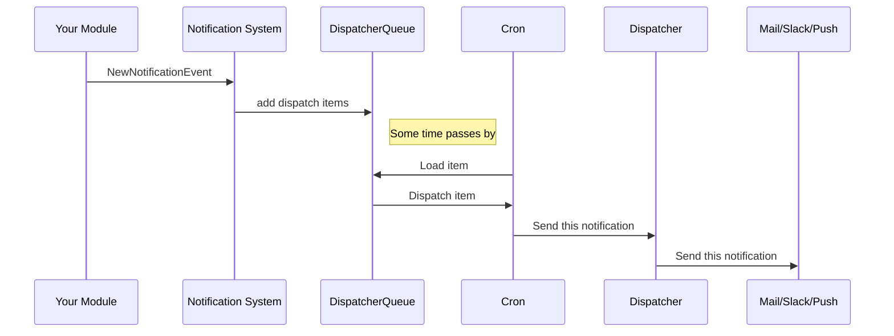
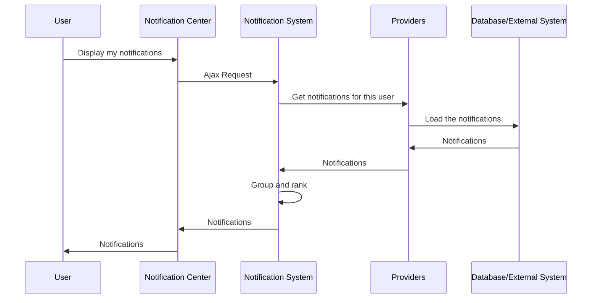

# Workflows

There are two workflows, that the notification_system can handle:

1. [Active Dispatch Flow](#active-dispatch-flow)
2. [Passive Aggregation Flow](#passive-aggregation-flow)

Here we will explain the differences and how it works internally.

## Active Dispatch Flow

This is basically the well known concept of push notifications.
A event happens, and the user gets notified.

1. A **[`NewNotificationEvent`](05_new_notification_event.md)** is
   thrown.

   This could happen when new content is created, a database
   notification is created, or simply via a webhook that is called
   from an external system (or in any other way that you implement).

2. The notification_sytem iterates over all the users of the
   notification, checks what dispatchers these users have enabled and
   **creates new items** in the `DispatchQueue`.

3. **Cron runs** and iterates over queue items.

   Alternatively you can process the `DispatchQueue` items via drush.

   Also note, that dispatching notifications to a large group of
   users can take some time. You can install the [Queue UI module](https://www.drupal.org/project/queue_ui)
   to monitor the status of the queue.

   To improve dispatch speeds, make sure that cron runs very often.
   (Maybe every minute?)

4. **[Dispatchers](06_dispatchers.md)** send out the notification.

   In this step, the emails / slack messages / ... will be sent out.

Required modules for this workflow:

- notification_system
- some [Notification Provider](04_providers.md)
- notification_system_dispatch
- One or more [Dispatcher](06_dispatchers.md) (for example
  notification_system_dispatch_mail)

## Passive Aggregation Flow

Passive aggregation is the fit for use cases where all notifications
for a user should be displayed. For example in the
[Notification Center](XX_notification_center.md). In contrast to the
Active Dispatch Flow, here the entrypoint is the user, requesting
his notifications.

For this example, we will assume, that you have placed the
Notification Center Block somewhere on your page, but it is also
possible to create a custom page or block where you use the
[`NotificationSystem` service](XX_display_notifications_in_a_custom_way.md)
directly to request the notifications.

1. The `Notification Center` block is shown.
2. The block makes an ajax request to notification system.
3. The notification_system asks all [providers](04_providers.md) for
   notifications of a user.
4. The providers load the notifications from database or external
   servers.
5. The notification_system ranks the notifications and returns a list
   of notifications to the browser.
6. The `Notification Center` block displays the notifications.

Required modules for this workflow:
- notification_system
- some [Notification Provider](04_providers.md)
