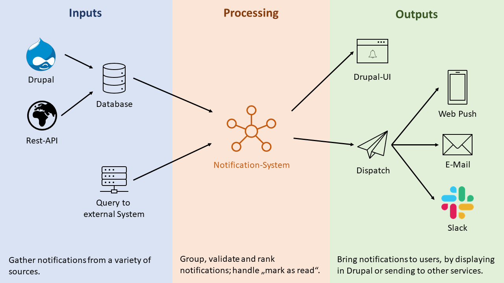

# Notification System

The **notification_system** module provides a pluggable architecture
for displaying and sending notifications in drupal.

It is built as a base module for developers to provide notifications
from their own modules.

It doesn't matter where the notifications are stored, so it is
possible to have notifications that are in the drupal database, in
external applications and also notifications that are generated on
request.

The module is designed based on plugins so every module can implement
its own notification provider. Adminstrators can then bundle
notification types to groups and show them to the user in form of a
notification center or a block on the frontpage or however you want.
The module is so basic that it can handle all cases.

With the notification_dispatch submodule, it is possible to send out
the gathered notifications via multiple "dispatchers", for example by
email or via web push. But a dispatcher for Slack or Microsoft Teams
is also possible, as the dispatcher is also extensible via plugins.

## Index
1. [What is a notification?](01_what_is_a_notification.md)
2. [The Notification Model](02_notification_model.md)
3. [Workflows](03_workflows.md)
4. [Providers](04_providers.md)
   - Example 1: [Database notifications](04_1_providers_example_database.md)
   - Example 2: [Query notifications from the Drupal system](04_2_providers_example_query_from_drupal.md)
   - Example 3: [Notifications from an external service](04_3_providers_example_external_service.md)
5. [The `NewNotificationEvent`](05_new_notification_event.md)
6. [Dispatchers](06_dispatchers.md)
   1. [Dispatcher module configuration](06_1_dispatcher_module_configuration.md)
      1. [Notification Bundling](06_1_dispatcher_module_configuration.md#notification-bundling)
      2. [Forced Notifications](06_1_dispatcher_module_configuration.md#forced-notifications)
   2. List of dispatchers
      1. [E-Mail Dispatcher](06_2_1_dispatcher_mail.md)
      2. [Web Push Dispatcher](06_2_2_dispatcher_web_push.md)
   3. [Dispatcher UserSettings Block](06_3_dispatcher_usersettings_block.md)
   4. [Creating a custom dispatcher](06_4_custom_dispatcher.md)

## Todo index

These topics are currently missing documentation which will be added later.

- System
  - Groups and category mapping
  - Notification System Database Configuration
    - Delete read after x days
  - Ranking
  - Notification Center Block
  - Display the notifications in a custom way
    (Explain the service)
  - Marking notifications as read
- Dispatchers
  - Dispatcher User Settings Block
  - E-Mail
  - Web Push
    - Apple Safari Web Push
  - Create your own dispatcher
    - Note that you could have multiple
    - Note that body can contain html and maybe has to be converted with example how to do it
